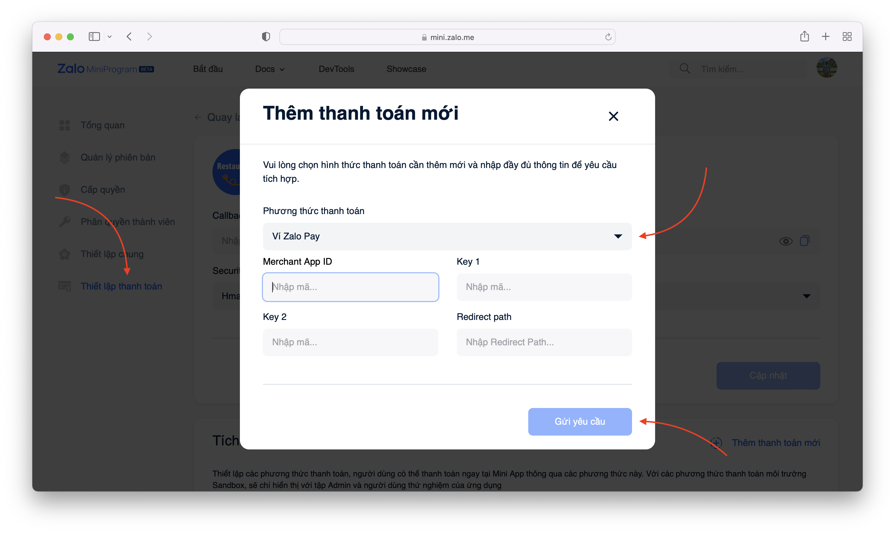

# QCDC BGG

<p style="display: flex; flex-wrap: wrap; gap: 4px">
  
  
  
  
  
  
</p>

Starter template for building a restaurant's mini program. Main features:

- View popular or nearby restaurants
- View restaurant's details and menu
- Book a table or order food online
- View booking history

|                          Preview                           |                                     Open Zalo and scan this QR                                      |
| :--------------------------------------------------------: | :-------------------------------------------------------------------------------------------------: |
|  |  |

## Pre-requisites

1. [Install Node JS](https://nodejs.org/en/download/)
1. [Install Mini App DevTools CLI](https://mini.zalo.me/docs/dev-tools)
1. Download or clone this repository

## Setup

1. Install dependencies

   ```bash
   npm install
   ```

1. Start dev server using `zmp-cli`

   ```bash
   zmp start
   ```

1. Open `localhost:3000` on your browser and start coding 🔥

## Deployment

1. Create a mini program. For instruction on how to create a mini program, please refer to [Coffee Shop Tutorial](https://mini.zalo.me/docs/tutorial/step-1/#1-tạo-một-ứng-dụng-zalo-mini-program-mới-trên-trang-chủ-của-zalo-mini-program)

1. Setup payment methods if you want to accept online payments
   

1. Deploy your mini program to Zalo using the mini app ID created in step 1.

   ```bash
   zmp login
   zmp deploy
   ```

1. Open Zalo and scan the QR code to preview your mini program

## Usage:

The repository contains sample UI components for building your application. You might wish to integrate internal APIs to fetch restaurants, menu, booking history,... or modify the code to suit your business needs.

Folder structure:

- **`src`**: Contain all logic source code of your Mini App. Inside `src` folder:

  - **`components`**: reusable components written in React.JS
  - **`css`**: Stylesheets, pre-processors also supported
  - **`pages`**: a Page is also a component but will act as an entire view and must be registered inside `app.tsx` as a Route (https://mini.zalo.me/docs/zaui/components/router/ZMPRouter/).
  - **`services`**: reusable logic for complex tasks that should be separated from your component, such as fetching API, getting location from Zalo or caching stuff,...
  - **`utils`**: reusable utility functions, such as math function, get image url, etc,...
  - **`app.ts`**: entry point of your Mini App
  - **`hooks.ts`**: building your own Hooks lets you extract component logic into reusable functions, such as adding product to cart, resetting product picked.
  - **`model.ts`**: contain TypeScript type and interface declarations
  - **`modules.d.ts`**: contain TypeScript declarations for third party modules
  - **`state.ts`**: state management, containing Recoil's atoms and selectors (https://recoiljs.org/docs/introduction/getting-started#atom)

- **`app-config.json`**: Global configuration for your Mini App (https://mini.zalo.me/docs/framework/getting-started/app-config)

The other files (such as `tailwind.config.js`, `vite.config.ts`, `tsconfig.json`, `postcss.config.js`) are configurations for libraries used in your application. Visit the library's documentation to learn how to use them.

## Recipes

### Changing restaurant's name

Just change the `app.title` property in `app-config.json`:

```json
{
  "app": {
    "title": "QCDC BGG"
  }
}
```

### Changing restaurant's logo

Visit [Zalo Mini Program](https://mini.zalo.me/) and go to your mini program's settings to change the logo.

### Changing color theme

You can change the primary and the secondary color theme by setting the colors in `app-config.json`:

```json
"template": {
  "primaryColor": "#0068ff",
  "secondaryColor": "#ff8a00",
},
```

| Default                                                                  | black + black                                                        | #008001 + #9A0007                                                    |
| ------------------------------------------------------------------------ | -------------------------------------------------------------------- | -------------------------------------------------------------------- |
|  |  |  |

The two colors will affect most of the application components. To make a deeper color change, override the other colors in `src/css/app.scss`. For the list of available colors, please visit [Color Theme](https://mini.zalo.me/docs/framework/components/color-themes/).

## License

Copyright (c) Zalo Group. and its affiliates. All rights reserved.

The examples provided by Zalo Group are for non-commercial testing and evaluation
purposes only. Zalo Group reserves all rights not expressly granted.
